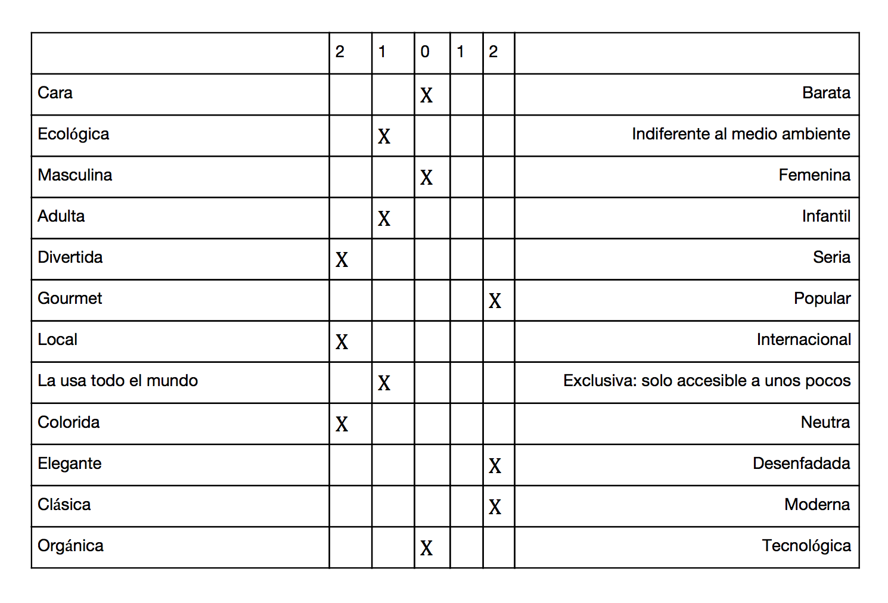
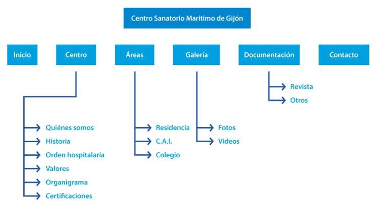
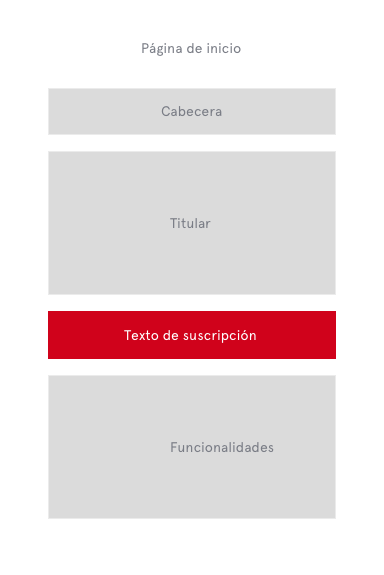
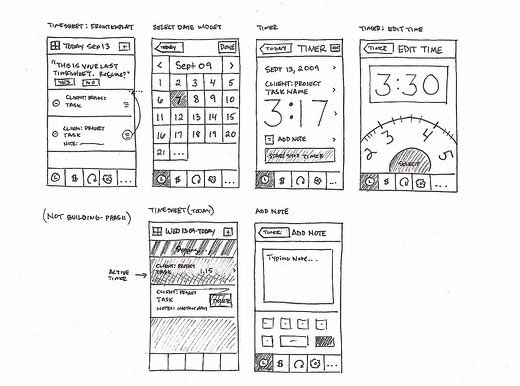
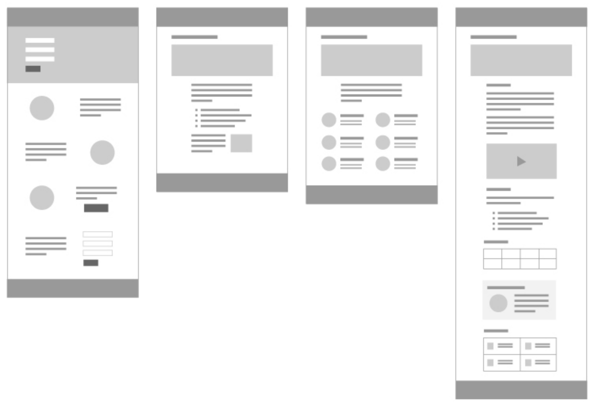
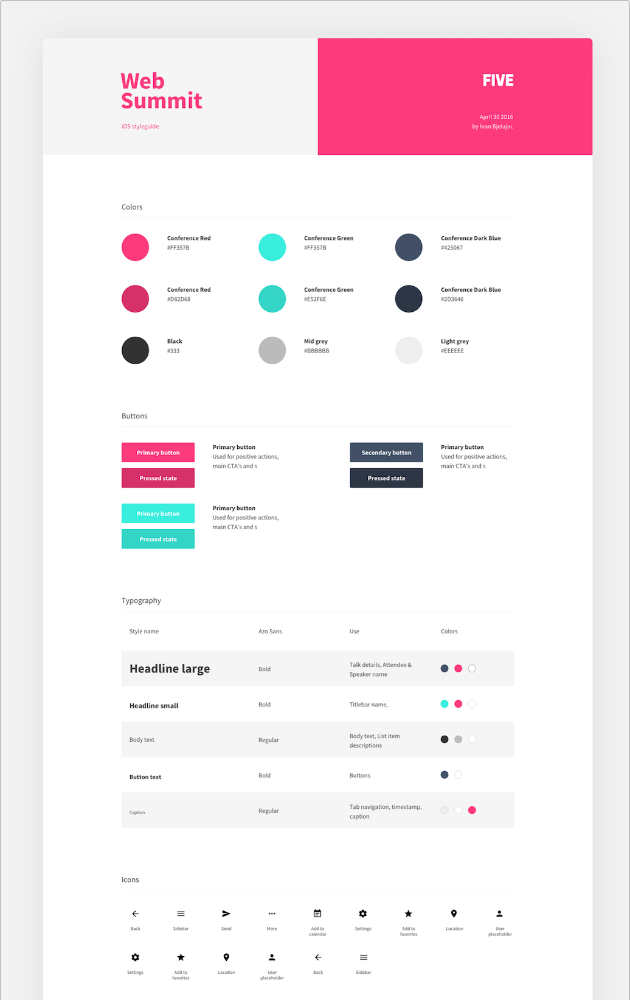

# Cómo diseñar una web desde cero

## Índice

- Introducción
- Pasos para diseñar una web
  1. Definir la idea principal de la web y el contenido
  1. Estructurar el contenido
    - Sitemap
    - Estructura de cada página
  1. Bocetos en papel de la página
  1. Low-fidelity wireframes (paso opcional)
  1. Diseño de identidad y linea gráfica
    1. Elección de conceptos
    1. Búsqueda de referencias
    1. Realización de la marca y la guía de estilos
  1. High-fidelity wireframes (paso opcional)
  1. Implementación del diseño final en código
- Para profundizar más

## Introducción

En esta guía veremos de forma breve el proceso que hay que llevar a cabo para realizar una web desde el momento en el que surge la idea hasta el punto en el que el diseño está listo para ser pasado a código.

El proceso descrito en esta guía es bastante similar al proceso real que se lleva a cabo en las empresas, la única diferencia es que en este caso se ha eliminado parte del proceso de investigación previa al diseño y se ha simplificado por adaptarlo a los tiempos de este bloque del curso.

Y te preguntarás: "¿por qué hay que diseñar si el curso es de programación?". En realidad los programadores front-end estamos muy unidos al diseño y en muchas ocasiones nos toca tomar decisiones respecto a este o aportar soluciones sobre este campo. En las empresas más punteras la división del trabajo es mayor pero al salir al mercado es bastante común que las empresas pidan algo de conocimientos de diseño e incluso demanden un perfil que combine diseño y programación. Desde Adalab, queremos que entiendas cuál es el proceso y lo pongas en práctica para saber adaptarte mejor a la empresa e incluso adquirir ciertos conceptos y habilidades que te permitan destacar frente a otros en ofertas de empleo.

El beneficio de realizar todos estos pasos es que en cada momento nos centramos en una tarea concreta: conceptualizar, diseñar o programar. De esta forma nos enfocamos mejor en lo fundamental de cada fase y el resultado final se ve beneficiado. Otro de los beneficios de diseñar antes de programar es que ahorramos mucho más tiempo que si hacemos ambos pasos a la vez. Piensa que hacer un cambio en un papel nos lleva 5 minutos, mientras que hacerlo en una web puede llevar fácilmente media hora o más.

## Pasos para diseñar una web

A continuación vamos a detallar los pasos para diseñar una web, estos pasos no son un estándar pero si que se suelen ser comunes en muchas empresas, siempre con matices.

Muchos de estos pasos serán opcionales y la duración de cada uno, para este proyecto en concreto, deberá ser la suficiente para tener una idea de lo que vamos a crear sin que se consuma el tiempo para desarrollarlo.

¡Vamos allá!

### 1. Definir la idea principal de la web y el contenido

Nada como empezar por saber qué información queremos transmitir en nuestra web y a qué público. Es fundamental que tengamos claro el objetivo de la web y el contenido que vamos a meter dentro para saber cómo vamos a diseñarla. Probablemente alguna vez hayas oido la expresión "la forma sigue a la función", en el caso de la web sucede lo mismo. Lo más importante de una web es el mensaje que se transmite, es decir, el contenido (tanto textual como visual). Por tanto, antes de ponernos a diseñar la web tendremos que saber que queremos transmitir para poder adaptar lo mejor posible ese diseño a la función que queremos que desempeñe la página.

En los proyectos reales, a menudo esta fase la realiza un cliente externo a nuestra empresa o el departamento interno de marketing o producto. Estos son los que definen qué quieren transmitir, el público, etc. Normalmente toda esta información queda reflejada en un documento. Ese documento recibe el nombre de briefing y recoge la información fundamental sobre cuales son los requisitos y las necesidades del proyecto. En este caso, ese briefing tendremos que realizarlo nosotros y en él deberemos hacernos las siguientes preguntas para tener claro que vamos a transmitir y que información es necesaria para comunicarlo:

------

## Briefing sitio web

### Marca, producto o servicio

#### Función de la web
_Cuál es el objetivo principal de la web_

>Ej: Mi web es una web promocional de un festival y los objetivos principales son promocionar el festival y aumentar la venta de entradas.

### Comunicación

#### Estilo de comunicación con el público
_Qué tipo de comunicación tienes con tu público. Cordial, informal, graciosa, seria..._

>Ej: Comunicación cercana, clara e informal pero sin usar lenguaje jóven o moderno.

#### Atributos clave de se quiere asociar a la marca y el producto o servicio
_Definir mediante tres palabras los atributos que se quieran asociar al producto_

>Ej: exclusiva, ecológica, infantil, divertida, rápida...

En esta sección siempre viene bien hacer una tabla de opuestos para ayudarnos a entender como queremos que sea nuestra marca y solventar bloqueos. A continuación se muestra una imagen de ejemplo:

#### Público objetivo o target
_A que tipo de clientes va dirigido el producto_

>Ej: Varones de entre 20 y 35 años que son aficionados a los deportes, padres de familia que hacen escapadas de fin de semana (pueden ser varios perfiles, es lo normal). Público español o público internacional...

### Diseño

#### Dimensiones y soporte
_Características del soporte y las dimensiones que influyen en el diseño_

>Ej: Soporte web para pantallas de escritorio, móvil o tablet...

#### Requisitos adicionales
_Espacio para incluir cualquier requisíto concreto para este proyecto_

>Ej: Texto oscuro sobre fondo blanco, que aparezcan nuestros patrocinadores, meter un video promocional en la cabecera, explicar que las pruebas son gratuitas, que tenga un menú vertical en vez de horizontal. En este caso los requisitos vienen por parte de Adalab ;)...

#### Referencias
_Qué marcas o páginas web te gustan, aunque no sean de tu sector y las razones_

>Ej: Airbnb.com porque tiene un diseño simple e intuitivo y los colores me parecen bonitos, Google.es porque tiene un diseño simple y poco cargado...

### Proyecto

#### Plazos
_Fechas clave durante el desarrollo del proyecto_

>Ej: 14 de Enero entrega de prototipo para los inversores, 30 de marzo lanzamiento de la web... Aquí también se puede definir el tiempo para las estimaciones que pensamos que nos va a llevar cada etapa.

------

Una vez hayamos respondido estas preguntas tendremos claro qué queremos comunicar y que información vamos a introducir para intentar que ese mensaje que queremos transmitir se cumpla, por lo tanto tendremos la función principal de la web y el contenido necesario. Esto nos será de gran ayuda en el futuro para saber qué texto deberemos escribir, que imágenes deberemos crear para acompañar a ese texto y cuál deberá ser la linea gráfica visual para transmitir mediante gráficos la imagen que queremos.

### 2. Estructurar el contenido

Ahora que tenemos claro qué queremos contar, es el momento de organizar la información para optimizar el mensaje. Para ello, no hay nada mejor que ver cómo deberíamos de meter la información en nuestra web, en esta fase nos haremos preguntas similares a las siguientes:

- ¿Tiene sentido meter toda la información en una página web o es mejor crear varias para las distintas secciones?
- ¿Qué contenido es más importante y cuál menos?
- ¿Es realmente toda la información fundamental? ¿Podríamos quitar algo?
- ¿Estamos repitiendo mucho el contenido? ¿Deberíamos meter algo de información para no hacerlo tan monótono?

Esto no nos asegura que vayamos a estructurar el contenido de la mejor forma posible pero si que nos permite hacernos pensar el por qué de cada decisión y que nada quede al azar en la estructura.

Como consejos es importante que el contenido jerarquizado, es decir, lo más importante destaque a lo que menos y por tanto se muestre arriba en la estructura. Otro punto importante es la reiteración, si yo quiero transmitir una idea es bueno repetirla en varios puntos de la web, siempre teniendo cuidado de que no se repita en exceso para no crear una sensación no deseada en la gente que visita la página.

Tras hacer el ejercicio de reflexionar acerca de como queremos organizar el contenido, es el momento de plasmarlo de alguna forma. En este caso lo que haremos será reflejarlo en dos estructuras diferentes:

- Sitemap: Un sitemap es la representación visual de la estructura de páginas de nuestra web y cómo están relacionadas. En él definimos páginas y subpáginas y permite ver a simple vista la organización de nuestra web. Hay gente que incluye en el sitemap las secciones de cada página, es decir, si tienes una página inicial con cuatro apartados, esos apartados se mostrarían en el sitemap. Nosotros mostraremos en el sitemap solo las páginas y dejaremos las secciones para la parte de estructura del contenido, así tendremos una vista global de las páginas y su relación sin entrar al detalle de qué es lo que contiene cada una.

- Estructura del contenido de las webs: En esta parte, reflejaremos cuál va a ser el contenido de cada página a grandes rasgos, es decir, mostraremos que bloques irán en cada página, el orden que tendrán, el tamaño (aproximado siempre ) y la importancia. Esto no será algo definitivo, sino más bien una guía pero nos servirá para facilitarnos la tarea de ver cómo vamos a crear la web. Crearemos la estructura de contenido de cada página para tener claro cómo serán todas ellas. En la imagen se puede ver que se establecen ya los tamaños y las partes más importantes, el color no tiene relación con el que se usará en el diseño final, simplemente sirve para reflejar que esa sección será destacada.

### 3. Realizar bocetos en papel de la página

Aquí empezamos con la acción. Ya tenemos claro qué es lo que queremos contar, cómo vamos a contarlo y cuál va a ser la estructura de nuestro mensaje. Es el momento de pasar estas ideas al soporte, de convertirlas en un diseño. En esta fase definiremos cada página usando un papel y un lápiz, de forma rápida pero que quede claro qué elementos vamos a poner en cada una de ellas (botones, imágenes, menús, etc.) La idea es hacer algo en sucio que sea fácil de realizar y modificar para jugar con la posibles ideas que tengamos de forma rápida.

Para esta página empezaremos con el diseño para dispositivos móviles, asi que el diseño deberá ser enfocado a un móvil. Veremos el por qué de este requisito durante la clase de diseño responsive. Si se desea, también se puede realizar el diseño para pantallas de ordenador siempre y cuando no quite mucho tiempo a la función principal del curso: aprender programación.

Si se decide diseñar la versión para pantallas de ordenador, es importante que el diseño no sea radicalmente diferente a la versión móvil, cuanto más distinta sea más difícil será para el usuario identificar la información que encuentra en el móvil en su ordenador y viceversa y además cuanto más varie más tiempo nos llevará realizar la web y más complejidad tendrá el trabajo.

Es importante que en esta pensemos solo en elementos, no en diseño final. Es decir, no hace falta hacer un diseño con acabados muy cuidados porque estos serán solo de referencia para saber qué vamos a poner en cada sitio.

### 4. Creación de los low-fidelity wireframes

**Importante:** Para el proyecto de diseño de nuestro sitio web no vamos a realizar este paso porque llevaría demasiado tiempo en realizar el diseño y nos desviaríamos del objetivo más importante, aprender a programar. Aún así lo explicamos brevemente para que sepáis que este paso se suele realizar en proyectos reales.

Una vez hechos los bocetos en papel, lo normal es pasar esos bocetos a un diseño de baja fidelidad. Se llama diseño de baja fidelidad (low-fidelity wireframe) porque el resultado no tiene porque ser muy parecido al diseño final, simplemente reflejar qué elementos va a haber en la web y cómo se van a distribuir.

Este paso es muy parecido al anterior de realizar bocetos, pero en este caso se busca una solución con mayor calidad y un poco más de detalle, que permitirá crear los diseños finales de forma más rápida.

### 5. Diseño de la identidad y la linea gráfica de la web

Tenemos la estructura, las vistas, el contenido...Pero le queda el toque más importante, darle identidad a la web, darle nuestro toque para hacerlo diferente y transmitir nuestra esencia. Para ello lo que debemos hacer es pensar en conceptos que queremos transmitir y llevarlos a una representación gráfica a través de formas, colores y ornamentos. Para ello, elegiremos dos o tres conceptos, haremos pruebas con ellos, buscaremos referencias y, por último, realizaremos pruebas para escoger la marca final y una guía de estilos que combine bien con esta.

#### 1. Elección de conceptos

Esta fase consiste en sacar conceptos para nuestra marca y atributos clave que queremos asociarle. La idea es sacar dos o tres conceptos de marca y uno o dos atributos. Esto nos permitirá jugar con ideas y combinarlas con atributos para obtener el resultado que muestre la esencia de la marca con la apariencia clave.

> Por ejemplo, si tenemos una empresa de alquiler de motos eléctricas, podríamos elegir como conceptos "la energía que te mueve", "donde quieras, sin atascos" y "rápido y ecológico" y como atributos "rapidez", "económico" e "innovación".

#### 2. Búsqueda de referencias

Es el momento de buscar inspiración que nos permita hacer el clic en nuestra cabeza para obtener la representación visual de lo que queremos conseguir. Lo normal es, por un lado, buscar inspiración relacionada con los conceptos que hemos elegido, y por otro, buscar inspiración general para los estilos que vamos a emplear en realizar nuestra marca y la linea gráfica de la web. Una vez tenemos varias imágenes de referencia, lo normal es crear un moodboard. Un moodboard no es otra cosa que un documento que recoge todas las imágenes que nos sirven de inspiración para agruparlas en un mismo sitio y tener una imagen global. Algunos realizan los moodboards por separado (referencias para la marca y referencias para el estilo), aquí es un poco al gusto de cada uno.

#### 3. Realización de la marca y la guía de estilos

Tenemos los conceptos y los atributos de la marca y tenemos las referencias, es el momento de jugar. La idea es probar distintas formas buscando que representen los conceptos que hemos obtenido de la fase de elección de conceptos e intentar darles atributos usando estilos inspirados en las referencias que hemos buscado.

Una vez hemos jugado y probado varias opciones y tenemos ya clara cual queremos, es el momento de realizar una guía de estilos que cuadre con la marca y tenga relación con esta. Además, en esta fase añadiremos color a la marca y elegiremos una tipografía (fuente) que transmita los atributos que hemos escogido. El resultado final será una guia de estilos que servirá como referencia a la hora de diseñar los wireframes (las vistas) finales de la web.

Ahora que tenemos la guía de estilos y la marca, ya tenemos la referencia visual que nos servirá como referencia para aplicar los estilos al resto de la web.

### 6. Realización de los high-fidelity wireframes

**Importante:** Para el proyecto de diseño de nuestro sitio web no vamos a realizar este paso porque llevaría demasiado tiempo en realizar el diseño y nos desviaríamos del objetivo más importante, aprender a programar. Aún así lo explicamos brevemente para que sepáis que este paso se suele realizar en proyectos reales.

Como su nombre indica (wireframes de alta fidelidad), este tipo de wireframes serán lo más parecido posible al resultado deseado desde el punto de vista de diseño. La idea es coger el resultado de la fase de creación de los low-fidelity wireframes y combinarlo con el resultado de la fase de desarrollo de la linea gráfica de la web para crear un resultado que combine una buena estructura y un diseño acorde a lo que se quiere transmitir.

En esta fase es cuando realmente prestamos atención a los detalles estéticos (bordes redondeados, sombras, colores, etc.) así como a las tipografías (fuentes), imágenes e iconos.

Cuanto más cuidemos el resultado, más fácil nos será luego implementarlo y menos cambios tendremos que hacer si vemos que algo del diseño nos cuesta mucho realizarlo con código.

Algunos consejos importantes:

- Diseñaremos siempre con el pixel como medida para márgenes, relleno, tamaño de fuentes y bordes y con el porcentaje para anchos y algunas alturas
- Lo normal es diseñar en una pantalla de 320x480
- Es recomendable usar múltiplos de 12, 8 o 10 para las medidas, de esta forma creamos cierto ritmo y consistencia en el diseño
- Lo normal para los márgenes en móvil es usar entre 16 y 24 píxeles
- Usar un interlineado de entre 1.4 y 1.6 para el texto ayuda a dar espacio y lo deja mucho menos sobrecargado.
- Es fundamental usar un grid para las vistas en ordenador

Como referencia para esta fase, puedes echar un ojo a las guías de Material Design, el sistema de diseño que utiliza Google, para buscar inspiración y ver cómo trabajan ellos.

- [Material design](https://material.io/guidelines/material-design/introduction.html)

### 7. Implementación del diseño final en código

Llegó el momento. Una vez hemos realizado los pasos anteriores, ya podemos lanzarnos a crear el código de la web.

Lo fundamental de esta fase es intentar que el resultado sea lo más similar posible al diseño que hemos realizado, eso servirá como reto para medir nuestras habilidades de programación pero si procuramos cuidar al máximo el detalle aprenderemos a resolver problemas más complejos y por tanto mejoraremos nuestras habilidades de forma notable.

En el futuro veremos cómo algunas herramientas nos facilitan el proceso de pasar el diseño a código y obtener beneficios a la hora de ver distancias entre elementos, tamaños de tipografías y colores empleados, pero por el momento aprenderlas no será necesario para este proyecto.

Muchas veces se nos escapa algún detalle que no hemos tenido en cuenta en el diseño pero que al implementarlo vemos que es fundamental. En este tipo de casos tenemos dos opciones, realizarlo directamente o diseñarlo y posteriormente convertirlo a código. En los proyectos reales, la segunda opción suele ser la indicada ya que la maquetación debe ser el reflejo del diseño y no al revés. En este caso, ya que hemos sido nosotros los que realizamos el diseño, podemos modificar algo directamente en el código siempre que sea sencillo de realizar y tengamos estilos similares para otros elementos que podemos usar como referencia.

## Para profundizar más

Aunque durante las clases se mencionarán pequeños detalles sobre diseño, debido a la corta duración del curso y a que este está enfocado en programación, no profundizaremos mucho más en diseño. Debido a esto, a continuación mostramos una lista de recursos por si deseas aprender más sobre diseño ahora o en el futuro:

#### Design for Hackers (inglés)

> Para aprender sobre diseño en general enfocado en dispositivos móviles

Este libro es una introducción simple al diseño de productos digitales. El libro comprende desde información sobre el proceso de diseño hasta teoría de color y composición. Lo bueno del libro es que permite tener una visión global de este campo y adquirir los conocimientos necesarios para tener cierta sensibilidad.

- [Design for Hackers en Amazon (inglés)](http://amzn.eu/1ZtUYfx)

#### No me hagas pensar (Don't Make Me Think) (español e inglés)

> Para aprender sobre experiencia de usuario enfocado en webs

Este libro repasa las claves básicas de la usabilidad web con bastantes ejemplos. En general todo lo que dice sigue estando vigente porque son conceptos básicos que es imprescindible conocer, aunque a veces se nota el paso del tiempo y cómo ha evolucionado la Web desde que publicó el libro. Si podéis, leedlo en inglés porque la traducción no es del todo correcta en algunos casos.

- [Design for Hackers en Amazon (español)](http://amzn.eu/eKPph89)
- [Design for Hackers en Amazon (inglés)](http://amzn.eu/givEjel)

#### Universal Principles of Design (inglés)

> Para aprender sobre principios universales de diseño

Se trata de cien principios universales dentro del mundo del diseño. Cada principio viene expuesto en dos páginas: En la primera vemos el fundamento teórico y en la siguiente, ejemplos. Lo bueno de este libro es que es global, es decir, todo lo que se muestra en él puede aplicarse en cualquier rama del diseño. Por otro lado permite adquirir recursos y conocimientos que permiten mejorar nuestro diseño y que son fáciles de entender por como vienen explicados.

#### Sistemas de retículas por Josef Müller-Brockmann (español e inglés)

> Para aprender sobre composición y retículas.

Este es uno de los libros clásicos de teoría acerca de la composición. En su día fue creado para diseño editorial pero los conocimientos son facilmente extrapolables a otros campos del diseño. A lo largo del libro se explican conceptos sobre los sistemas de retículas con ejemplos y cuáles son las claves para que estos funcionen correctamente.

- [Sistemas de retículas en Amazon (español)](http://amzn.eu/0xH0bR4)

#### Design of Everyday Things

> Para entender mejor el papel clave del diseño en los productos de consumo

Este libro describe los principios sobre los que se asienta el diseño centrado en el usuario (user-centered design) o la experiencia de usuario (user experience o UX). El libro nos guiará a través de los principios fundamentales que se requieren para crear productos usables y comprensibles, que proporcionan placer y satisfacción y eliminar los problemas en aquellos productos que no cumplen con las expectativas del usuario.

En la plataforma de aprendizaje online de [Udacity](https://www.udacity.com) se imparte de manera gratuita un curso impartido por el propio autor del libro y que enseña los principios que recoge este libro. Aquí tenéis el enlace al [Curso de Udacity de Intro to the Design of Everyday Things](https://www.udacity.com/course/intro-to-the-design-of-everyday-things--design101)

- [Design of Everyday Things (inglés)](http://amzn.eu/4PYUHoX)
