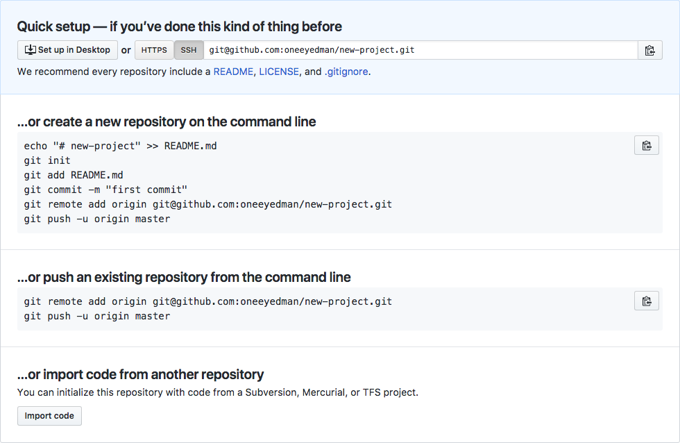
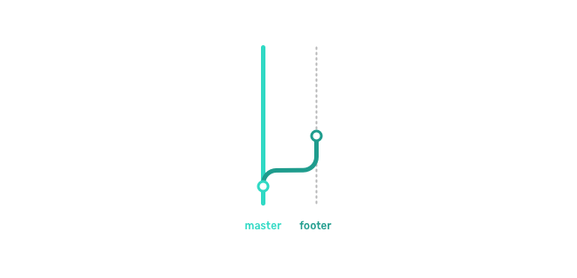
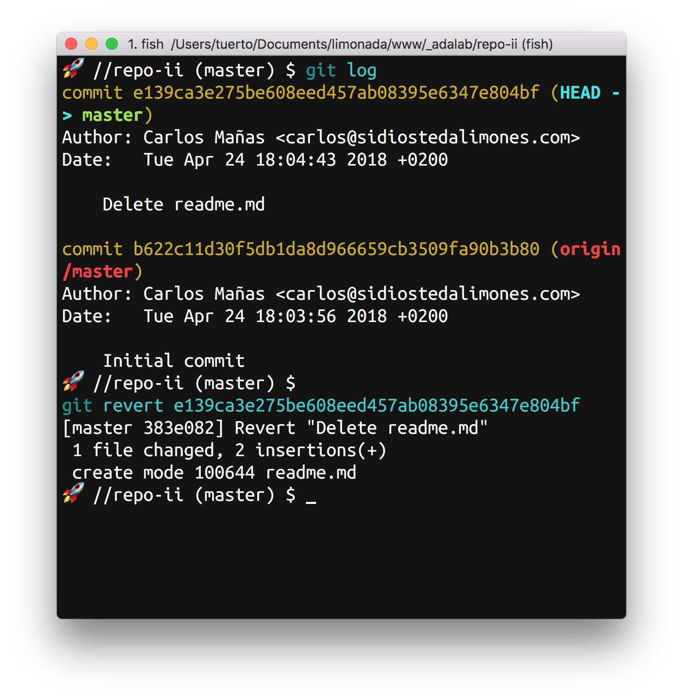
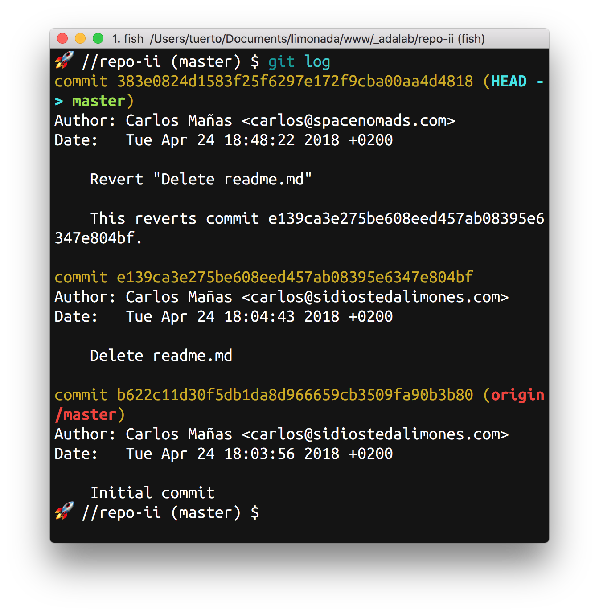

# Control de versiones

## Contenidos

<!-- TOC depthFrom:4 depthTo:6 -->

- [EJERCICIO 1](#ejercicio-1)
- [EJERCICIO 2](#ejercicio-2)
- [EJERCICIO 3](#ejercicio-3)
- [EJERCICIO 4](#ejercicio-4)
- [EJERCICIO 5](#ejercicio-5)
- [EJERCICIO 6](#ejercicio-6)
- [EJERCICIO 7](#ejercicio-7)
- [EJERCICIO 8.1](#ejercicio-81)
- [EJERCICIO 8.2](#ejercicio-82)

<!-- /TOC -->

## Introducción

Hasta ahora hemos hecho una primera aproximación a Git, nada menor.

1. Primero vimos cómo crear un repositorio local con `git init` y mantener nuestros cambios con `git add -A` y `git commit -m "Mensaje del commit"`.
1. Pero no solo eso, también hemos aprendido a conectar nuestro proyecto local con un repositorio remoto alojado en GitHub con `git remote add`
1. O directamente, a crearlo en Github y clonarlo en nuestro equipo con `git clone`.

También vimos cómo publicar nuestro trabajo a través del sistema de hosting propio de GitHub: **GitHub Pages**.

Hoy vamos a ver cómo trabajar en grupo sobre el mismo proyecto y sus archivos.

## Repaso del proceso de creación de un proyecto Git

### Inicio de un repositorio desde Github
Lo más sencillo es crear el proyecto de cero desde nuestro servicio de Git, en este caso, GitHub:

1. Vamos a nuestro perfil
1. Creamos un nuevo repositorio
1. Rellenamos el nombre y la descripción
1. Ahora podemos elegir tres acciones (se pueden elegir las tres, alguna o ninguna):
	1. Añadir un archivo `README.md`
	1. Añadir un archivo `.gitignore`
	1. Añadir una licencia
1. Una vez creado solo faltaría clonarlo a nuestro ordenador para trabajar con él, hay dos formas:
	1. Desde la terminal voy a la carpeta donde quiero clonar el proyecto y, con la url que me da GitHub para clonar, escribo: `git clone url-del-repositorio-que-me-da-github`.
	1. Si quiero clonarlo y usar un nombre específico para la carpeta de mi repositorio sigo el paso uno pero escribo: `git clone url-del-repositorio-que-me-da-github nuevo-nombre-de-carpeta`

### Inicio de repositorio desde un proyecto existente
¿Cómo? ¿Que ya teníamos un proyecto local y queremos subirlo a GitHub? Bueno, tampoco es tan malo:

1. **IMPORTANTE**: Antes de inicializar un repositorio debemos estar en la carpeta correcta. **Desde la terminal, con `cd`, nos desplazaremos dentro de la carpeta de nuestro proyecto.**
2. Inicializamos el repositorio local Git con `git init` (se hace desde la terminal y tenemos que asegurarnos de estar en la carpeta correcta).
3. Vamos a GitHub.com y creamos un repositorio nuevo (esta vez no añadiremos ni licencia, ni `README.md`, ni `.gitignore`) y GitHub nos redirigirá a una página con las instrucciones a seguir
4. Como ya hemos inicializado nuestro proyecto Git simplemente añadiremos el repositorio remoto. Usaremos `git remote add origin url-del-repositorio-que-me-da-github`.
5. Creamos cómodamente el `README.md` desde nuestro editor de código.
5. Añadimos los archivos con `git add -A`
6. Hacemos un primer commit `git commit -m "Initial commit"`
7. Y subimos, esta primera vez, con `git push -u origin master`



### README.md
El archivo `README.md` es un documento escrito en [markdown](https://es.wikipedia.org/wiki/Markdown) que se presenta en la página principal del repositorio y tiene como objeto aportar una primera documentación o presentación del proyecto.
Esto es una convención, pero hay que tenerla en cuenta.

> **NOTA**: Markdown es un lenguaje de marcado como HTML pero más simple.

Ejemplos de readme.md:
* [Sistema de plantillas PUG](https://github.com/pugjs/pug)
* [Editor de código VSCode](https://github.com/Microsoft/vscode)
* [Gulp (Automatizador de tareas)](https://github.com/gulpjs/gulp)

### .gitignore
Git tiene un sistema para poder ignorar archivos de un proyecto.
**¿Y por qué querríamos hacer esto?** Porque habrá archivos que necesitemos en nuestra carpeta de trabajo local pero que no queramos subir al repositorio ni controlar sus cambios.

En proyectos pequeños como los que tenemos ahora vamos a querer siempre subir al repositorio remoto todos nuestros archivos. Pero podría pasar que tuviésemos una carpeta con los archivos de diseño de ciertas partes del proyecto o archivos comprimidos que usamos para enviar a nuestro cliente los avances.

> **NOTA**:	Es muy común que el propio sistema operativo cree en cada carpeta una serie de archivos o carpetas ocultas que le ayudan a realizar tareas como la búsqueda de archivos.

Estos archivos, que no tiene sentido tener "controlados" pero que en nuestra carpeta local queremos mantener, se listan en este archivo especial, `.gitignore` para decirle al algoritmo de Git que no los tenga en cuenta.

En [gitignore.io](https://www.gitignore.io) podemos encontrar una serie de configuraciones ya hechas que nos ayudan a ignorar tipos de archivos comunes según el sistema operativo o el lenguaje en el que trabajemos.

### Licencia
Uno de los puntos claves un entorno social donde poner al alcance de todos tus proyectos es indicar cómo y en qué términos se deben usar. Para esto están las licencias, que son archivos legales que especifican qué se puede y qué no se puede hacer con los archivos asociados.

GitHub nos ofrece un enlace donde nos intenta orientar sobre qué licencia elegir en cada caso: [choosealicense.com](https://choosealicense.com).


## Compartir código con mi equipo
Otras de las bondades de Git es que hace que trabajar en grupo sea seguro y más fácil. Nos evita por ejemplo: tener que compartir archivos a través del email, perder código cuando una compañera lo sobreescribe por error...

Desde la página de nuestro repositorio accedemos a `settings` y desde allí a `Collaborators & teams` donde podremos añadir a nuestras colaboradoras favoritas, o a las que nos toquen ;)

### Modificar archivos en local y subir a remoto los cambios
Ya lo hemos ido viendo estos días:

1. Se modifican archivos y se guardan los cambios en el editor.
2. Se añaden para su control con `git add -A` (añade todos los archivos modificados) o con `git add nombre-de-archivo` (añade solo el archivo especificado)
3. Creamos el commit con `git commit -m "Short description of the commit"`

Hasta aquí todo normal. Ahora llega el momento de subir el commit (o los commits, si hemos hecho varios) con nuestros cambios al repositorio remoto con `git push origin master`, pero pueden pasar varias cosas:

1. Que se suba bien, sin problemas ni conflictos. Yay!
2. Que no podamos subir nuestros cambios porque no estemos trabajando con la última versión. En este caso tendremos que hacer `git pull` para actualizar nuestro repositorio local con la última versión que se encuentra en remoto, es decir, nos traeremos los últimos cambios hechos por otras personas a nuestro ordenador.

> **NOTA**: Antes de comenzar a trabajar (antes de empezar a hacer cambios en nuestros archivos) es una buena práctica hacer `git pull` y actualizar nuestro repositorio local con los cambios que otras personas han subido al repositorio remoto. Aun así, ocurrirá que tras hacer nuestros cambios y commitearlos, al intentar hacer `git push` el terminal nos indique que tenemos que hacer `git pull` primero, esto ocurre por que alguna compañera ha subido cambios mientras nosotras trabajábamos.


### ¿Qué pasa cuando hacemos un `git pull`?
Pasan varias cosas:

1. Git comprueba si en el repositorio remoto hay una versión posterior (más nueva) a la que se encuentra en nuestro repositorio local.
2. Si encuentra cambios posteriores, se los baja e la intenta mezclarlos con los de nuestros commits.

Y aquí tenemos dos escenarios diferentes:

1. Los cambios que se han bajado de remoto (realizados por mis compañeras) y los míos se pueden mezclar (o mergear) automaticamente, Git crea un commit automático con esta mezcla (o merge) y nos lo muestra usando el editor por defecto que tenemos configurado en nuestra terminal (NANO, vim...).
2. Otra posibilidad es que Git no pueda mezclar los cambios automáticamente. Entonces nos avisa de que hay conflictos que tendremos que resolver nosotras manualmente. Nos mostrará una lista de archivos donde encuentran los conflictos.

> **NOTA**: En el primer caso podremos cambiar el mensaje del commit automático o poner uno nuevo. Guardamos aceptando el nombre que nos propone, salimos, y hacemos un push (se subirá el commit con nuestros cambios y el commit con el merge o mezcla).

### ¿Qué pinta tiene un conflicto?
Un conflicto ocurre cuando git se encuentra con dos versiones del mismo bloque de código. Entonces, marca en el documento que hay un conflicto y muestra las dos opciones para que nosotros elijamos qué hacer:
```
<<<<<<<
1ª versión del código en conflicto
=======
2ª versión del código en conflicto
>>>>>>>
```

**<<<<<<<**: Indica el inicio de la zona de conflicto, en la línea siguiente muestra el primer bloque en conflicto.

**=======**: Separa las dos versiones, seguidamente muestra el bloque alternativo que está dando conflicto.

**>>>>>>>**: Indica el final e la zona de conflicto

Aquí puede pasar que queramos la primera opción, la segunda, las dos, o una mezcla de las dos.

La manera de **afrontar este conflicto** es elegir lo que queremos que ponga en ese bloque, quitar los separadores que añade Git, guardar el archivo y hacer add, commit y push con normalidad.

Los conflictos más pequeños los resolveremos sobre la marcha, en los más complicados tendremos que hablar con la compañera que haya hecho los cambios para decidir qué hacer.

## Ramas

Cuando subimos los commits habréis visto que escribimos `$ git push origin master`, lo que estamos diciendo es que suba muestra **rama master** al repositorio remoto.

### Madre de CROM, ¿¿qué es una rama???
Git nos permite crear versiones paralelas de nuestro proyecto para poder desarrollar o probar varias funcionalidades a la vez sin miedo a perder lo hecho hasta ahora:


Cuando iniciamos un repositorio git se crea una primera rama, y se llama `master` por convención. En la última sesión trabajamos en esa rama.

Vamos a ver el trabajo en ramas a través de un ejemplo, como un mini proyecto de grupo, porque al fin y al cabo, git va de trabajar en grupo.

* * *

#### EJERCICIO 1

1. Vamos crear un repositorio por pareja, donde ambas debéis tener acceso al repositorio (la que lo crea debe dar acceso al usuario de GitHub de la otra)
2. Crearemos una primera versión de nuestra web (solo en HTML) que tendrá:
	1. Un `<header>` con un `<h1>` con el nombre del grupo
	2. Un `<main>` con dos secciones:
		1. `<section class="motivacion"></section>`
		2. `<section class="contenido"></section>`
	3. Un `<footer>` con un `<p>` con el texto: "Maquetado en grupo en Adalab"
3. Lo subiremos a GitHub

Nos tiene que quedar algo así:
```html
<!DOCTYPE html>
<html lang="en">
<head>
	<meta charset="UTF-8">
	<title>Grupo nombre-de-grupo</title>
</head>
<body>
	<header>
		<h1>Grupo nombre-de-grupo</h1>
	</header>
	<main>
		<section class="motivacion"></section>
		<section class="contenido"></section>
	</main>
	<footer>
		<p>Maquetado en grupo en Adalab</p>
	</footer>
</body>
</html>
```

* * *

### Creando ramas
Para crear ramas escribimos `git branch nombre-de-la-rama` y nos movemos a ella con `git checkout nombre-de-la-rama`.

Tenemos un atajo para crear la rama y cambiarnos a ella directamente
```
git checkout -b nombre-de-la-rama
```

En cualquier caso, si queremos movernos de una rama a otra usaremos `git checkout nombre-de-la-rama`, de esta manera podemos movernos a nuestra nueva rama o volver a `master` en cualquier momento.

> **NOTA**: Para poder movernos entre ramas debemos tener todos los archivos modificados, al menos, añadidos a un futuro commit. Si modifico un archivo y me intento cambiar de rama no me dejará.

Añadir archivos y crear un commit funciona igual pero cuando queramos hacer un push usaremos:
```
git push origin nombre-de-la-rama
```

La primera vez usaremos el git push con `-u`:
```
git push -u origin nombre-de-la-rama
```

* * *
#### EJERCICIO 2

1. Una de la pareja creará una rama `footer`, nos movemos a ella y modificamos un poco nuestro proyecto. Añadiremos a nuestro footer el enlace a la web de Adalab, quedando así:
```html
<footer>
	<p>Maquetado en grupo en <a href="http://adalab.es">Adalab</a></p>
</footer>
```
2. Como siempre, añadimos, commiteamos y hacemos push, esta vez usando `git push -u origin footer`.
3. Si ahora cambiamos a la rama `master` veremos que permanece como la dejamos y que el cambio del enlace solo está hecho en nuestra rama `footer`.



* * *


### Fusionar ramas
Una vez que hemos terminado el trabajo en nuestra nueva rama y lo hemos subido al servidor remoto querremos aplicar estos cambios en nuestra rama principal, `master`.

Para ello nos vamos a la rama destino (en este caso `master`) con `git checkout master`,  y escribiremos:

```
git merge nombre-de-la-rama
```

Esto nos mezclará nuestra versión local de la rama `nombre-de-la-rama` con la rama donde estemos, en este caso, `master`. Si todo va bien nos mezclará las ramas, creará un commit automático y si hacemos un `git status` nos dirá que solo queda hacer un `git push origin master` y ya.

> **NOTA**:	Es importante haber hecho un `git pull origin nombre-de-la-rama` en la rama que vamos a fusionar, en este caso `nombre-de-la-rama` antes de empezar el proceso de fusión para asegurarnos de que tenemos la última versión en ambas ramas.


* * *

#### EJERCICIO 3

Vamos a fusionar nuestra rama `footer` con `master` para que nuestra web tenga el enlace que hemos añadido anteriormente.
Para ello:

1. Nos movemos a la rama `footer`
2. Comprobamos que está correcto y tenemos la última versión
3. Nos movemos a la rama `master` (sí, es super buena idea asegurarnos de que también tenemos la última versión)
4. Hacermos un merge de la rama `footer`
5. Resolvemos los conflictos si los hay
6. Comprobamos que los cambios está hechos
7. Y subimos al repositorio remoto

```html
<footer>
	<p>Maquetado en grupo en <a href="http://adalab.es">Adalab</a></p>
</footer>
```


* * *

#### EJERCICIO 4

Ahora que hemos hecho un primer acercamiento a las ramas, vamos a hacer lo mismo pero cada miembro de la pareja por separado. Cada una estará encargada de un trabajo diferente que tendrá que realizar en una rama y posteriormente mezclar en la rama principal.


Como refleja la imagen vamos a hacer dos ampliaciones de contenido:

1. una alumna de cada pareja tiene que añadir el contenido de la sección con una frase motivadora
2. la otra alumna de la pareja tiene que añadir el contenido de la sección con un título y un pequeño párrafo

**Sección con frase motivadora**
```html
<section class="motivacion">
	<h2>Frase súper motivadora, ¡a tope!</h2>
</section>
```

**Sección con frase y título**
```html
<section class="contenido">
	<h2>Contenido normal</h2>
	<p>Lorem ipsum dolor sit amet, consectetur adipisicing elit, sed do eiusmod tempor incididunt ut labore et dolore magna aliqua.</p>
</section>
```

> **NOTA**: Elegid bien el nombre de las nuevas ramas ;)

Ahora realmente da igual el orden, la que acabe su trabajo, que suba su rama al repositorio remoto, y siga los pasos para fusionarlo con master. **¡A por ello!**

* * *

## Entonces, ¿cómo se supone que tengo que trabajar con Git?
Lo normal es que antes de empezar a trabajar comprobemos si tenemos la última versión. También puede no hacerse y seguir trabajando en lo que se estuviese trabajando.
En cualquier caso, podemos comprobar si hay una versión nueva del proyecto con `git fetch` o comprobar y descargar una versión nueva con `git pull`.

Luego seguimos trabajando con normalidad, recordando guardar frecuentemente con `Ctrl+S`. y cuando creamos conveniente 'stageamos' (añadimos los cambios) con `git add` y 'commiteamos' (creamos nueva version) con `git commit`. **Siempre es buena idea hacer commit tras pequeñas tareas o cambios**.

Y pusheamos (subimos los commits) con `git push` cuando terminemos la tarea que nos toca.

## ¡Oh, dios mío! ¡¡He hecho un commit que no quería hacer!!
¿Qué pasa si hago un cambio, lo añado, hago commit y luego... querría no haberlo hecho? Pues no pasa nada, para eso trabajamos con un control de versiones.

Esto pasará de vez en cuando, unas veces por inexperiencia, otras por descuido y otras por otras razones, pero no hay miedo porque cada commit queda registrado y siempre podemos volver a consultar uno anterior o revertir el último. Vamos a ver cómo.

Si queremos ver nuestra actividad en el proyecto usaremos `git log`, esto nos mostrará un listado de los commits realizados.


En este caso, con el último commit, hemos borrado el archivo `readme.md` y ahora vemos que ha sido un error...

Nos gustaría deshacer el commit con el número (o hash): `e139ca3e275be608eed457ab08395e6347e804bf`, para ello usaremos `git revert`:

```
$ git revert e139ca3e275be608eed457ab08395e6347e804bf
```


y si aceptamos el revert, ya lo tenemos:



Si ahora hacemos un `git log` podemos ver cómo queda el historial de commits:




## Issues
Github, como otros servicios de control de versiones tienen un sistema de tickets, los issues. Te permiten crear pequeñas tareas donde solicitas información, avisar de un problema o de alguna mejora. Además, nos permiten asignar responsables, clasificarlas por etiquetas...


* * *
#### EJERCICIO 5

**Crear repositorio en GitHub**

Hay que crear un repositorio vacío en GitHub:
- ¿Qué licencia hemos elegido?
- ¿Por qué es importante añadir un README.md?

* * *

#### EJERCICIO 6

**Clonar repositorio**

Clonaremos el repositorio de nuestra compañera y le pondremos o abriremos un issue a través de la web de GitHub para que nos añada como colaboradora con permisos de escritura.

* * *

#### EJERCICIO 7

**Eliminar un repositorio**

No es tan habitual pero de tanto en tanto querremos hacer limpieza en nuestra cuenta de GitHub. ¿Seremos capaces de borrar el repositorio que acabamos de crear? ¿Sí, no? :)

* * *

#### EJERCICIO 8.1

**Crear un repositorio local y conectarlo con remoto**

Ahora vamos a trabajar de una manera menos habitual y un poco más complicada, pero a veces pasa: crearemos un proyecto en nuestro equipo, algo sencillito. Podemos elegir entre:
- Un html básico con un "hola, mundo" centrado en la ventana del navegador
- Un html básico con una sonrisa centrada en la ventana -> :) o :D

Una vez conseguido vamos a:

1. Inicializar un repositorio local `git init`
1. Hacer algún cambio y un commit.

Y ahora, ¿no sería genial conectarlo con un repositorio remoto y tenerlo siempre accesible en Github? Claro que sí.

1. En Github creamos un repo vacío SIN añadir licencia ni README.me (¿Por qué?).
2. Seguimos las instrucciones para conectarlo.
3. Hacemos push de los cambios hechos.
4. Añadimos a nuestra compañera como colaboradora y ella se clonará el repositorio.

* * *

#### EJERCICIO 8.2

**Solucionar un conflicto**

Una vez que tenemos las dos el repositorio en nuestro equipo vamos a modificar index.html a la vez. Cada miembro del equipo hará un cambio, su commit y lo subirá. El conflicto lo resolveréis entre las dos :)

* * *

## BONUS: Paquete de Code para Git

Code trae por defecto un paquete para integración con Git y GitHub que nos ayuda con las tareas de control de versiones de nuestro día a día.

En el explorador (menú de la izquierda), aparecen:

- de color verde los ficheros nuevos respecto al último commit local
- de color amarillo los ficheros modificados desde el último commit local

También en el panel principal, el editor del fichero que estamos editando, aparece a la izquierda del número de línea una franja de color:

- amarillo para las líneas modificadas desde el último commit
- verde las líneas nuevas desde el último commit

Este paquete también facilita una herramienta gráfica para resolver conflictos, que ayuda a elegir la versión del código que nos interesa mantener.

Además nos permite ver qué se ha modificado en nuestro proyecto solo haciendo click en el icono lateral

Podéis leer más sobre las posibilidades de [VS Code y Git](https://code.visualstudio.com/docs/introvideos/versioncontrol).
